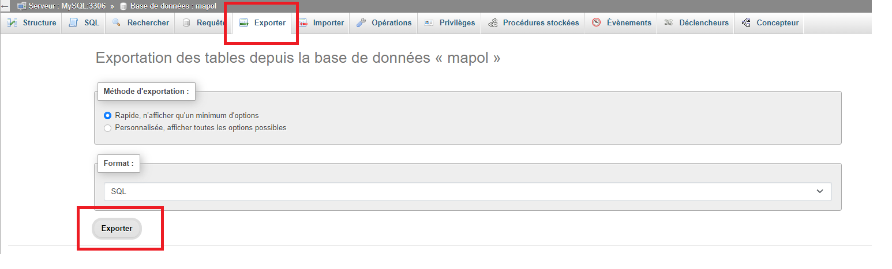
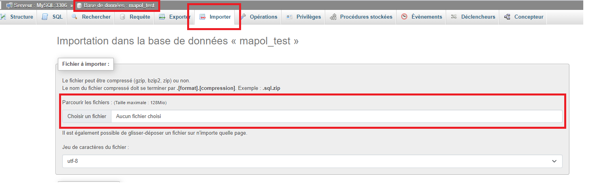

# Projet-LOL

## Récupérer le projet et toutes les branches 
``` 
git clone https://github.com/ZinedineFerrouk/Projet-LOL.git
git fetch -v --all
```

## Côté Back

### Configurer l'api Symfony 
```
Accèder au répertoire Back
cd back
1 - Installation des dépendances:
composer install

2 - Création de la BDD 

* Configuration du fichier .env avec la configuration de votre base de données:
exemple: DATABASE_URL="mysql://root@127.0.0.1:3306/nom_de_votre_bdd?serverVersion=5.7.31"

* Création de la BDD avec le symfony CLI
php bin/console doctrine:database:create

3 - Création des migrations:
php bin/console make:migrations

* Insertions des migrations en BDD:
php bin/console doctrine:migrations:migrate
```

### Lancement du serveur et chargement des données en BDD
```
Pour lancer le serveur:
symfony server:start

Insertions des données en BDD appeler la route suivante:
/api/get-all-data
```

### Lancement des tests unitaires PHPUnit
```
1 - Création d'une BDD de tests:
php bin/console --env=test doctrine:database:create

2 - Exporter la BDD créer plus haut:
```



```
3 - Importer la BDD dans la BDD de tests:
```


```
4 - Insertions des données en BDD appeler la route suivante:
/api/get-all-data
```
---

## Côté Front

```
Accèder au répertoire Front
cd front

1 - Installation des dépendances:
npm install

2 - Lancement du serveur React:
npm start

3 - Lancement de tous les tests uniataires:
npm test a
```
